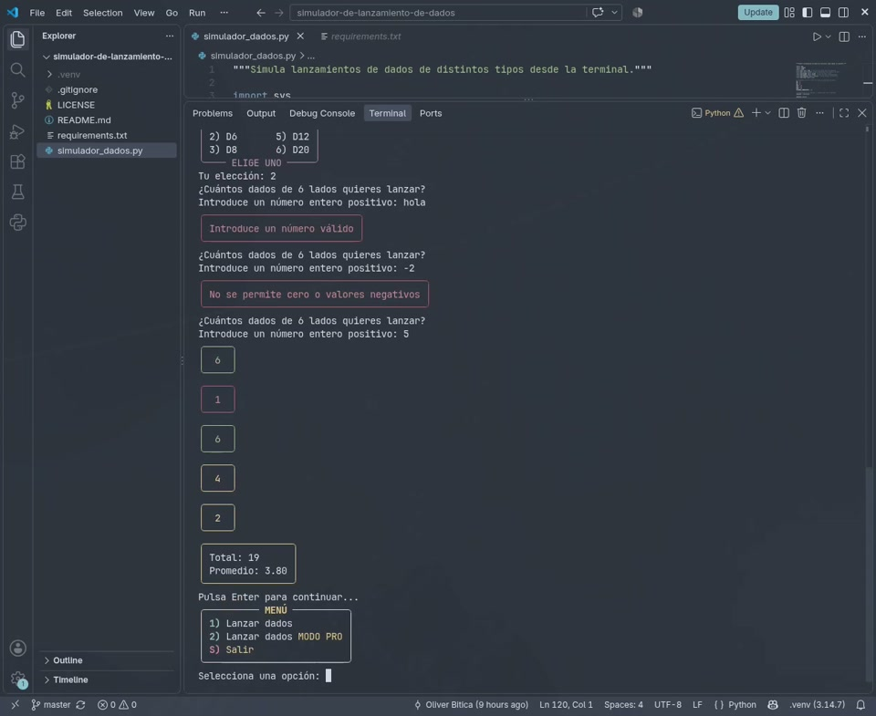

# Simulador de lanzamiento de dados

Aplicación de consola en Python para lanzar dados de distintos tipos con una animación y resultados coloreados mediante Rich.

<p align="center">
  <a href="assets/demostracion.mp4">
    
  </a>
</p>
<p align="center">
  <a href="assets/demostracion.mp4"><strong>▶ Ver vídeo de demostración</strong></a><br>
  <sub>Duración: 1 min 55 s · Formato MP4</sub>
</p>

## Requisitos

- Python 3.8 o superior
- Git

## Instalación

Clona el repositorio y entra en su carpeta:

```bash
git clone https://github.com/obiticadev/simulador-de-lanzamiento-de-dados.git
cd simulador-de-lanzamiento-de-dados
```

Crea un entorno virtual:

```bash
python -m venv .venv
```

Actívalo según tu sistema:

```powershell
# Windows PowerShell
.venv\Scripts\Activate.ps1
```

```bash
# Windows CMD
.venv\Scripts\activate.bat
```

```bash
# macOS / Linux
source .venv/bin/activate
```

Instala las dependencias:

```bash
python -m pip install -r requirements.txt
```

## Ejecución

```bash
python simulador_dados.py
```

En macOS o Linux, si el comando `python` no está disponible, usa `python3` en su lugar.
